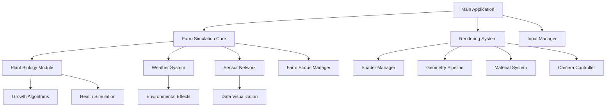

# 🔧 智能农场监控系统技术文档

## 📋 目录

1. [系统架构概述](#系统架构概述)
2. [核心模块详解](#核心模块详解)
3. [渲染管线技术](#渲染管线技术)
4. [植物模拟算法](#植物模拟算法)
5. [传感器网络架构](#传感器网络架构)
6. [性能优化策略](#性能优化策略)
7. [扩展开发指南](#扩展开发指南)

---

## 🏗️ 系统架构概述

### 分层架构设计

```
┌─────────────────────────────────────────────────────────────┐
│                    应用层 (Application Layer)                │
├─────────────────────────────────────────────────────────────┤
│                    业务逻辑层 (Business Logic)               │
├─────────────────────────────────────────────────────────────┤
│                    数据模型层 (Data Model)                  │
├─────────────────────────────────────────────────────────────┤
│                    渲染引擎层 (Rendering Engine)             │
├─────────────────────────────────────────────────────────────┤
│                    平台抽象层 (Platform Abstraction)         │
└─────────────────────────────────────────────────────────────┘
```

### 模块依赖关系



---

## 🔧 核心模块详解

### 1. 渲染引擎 (Rendering Engine)

#### RenderObject 结构
```cpp
struct RenderObject {
    std::vector<Vertex> vertices;        // 顶点数据
    std::vector<unsigned int> indices;   // 索引数据
    GLuint VAO, VBO, EBO;               // OpenGL缓冲对象
    bool transparent;                    // 透明度标记
    glm::vec3 center;                   // 几何中心
    bool isValid;                       // 有效性标记
    bool castShadow;                    // 阴影投射
};
```

#### 顶点数据格式
```cpp
struct Vertex {
    float x, y, z;        // 位置坐标
    float r, g, b;        // 颜色值
    float nx, ny, nz;     // 法线向量
    float u, v;           // 纹理坐标
    float materialType;   // 材质类型ID
};
```

### 2. 植物生物学模块 (Plant Biology)

#### 植物实例结构
```cpp
struct DetailedPlant {
    glm::vec3 position;                      // 世界位置
    float height, stemRadius;                // 物理尺寸
    int leafCount;                          // 叶片数量
    float healthFactor;                     // 健康系数 [0-1]
    int plantType;                          // 植物类型 (0-3)
    float growthStage;                      // 生长阶段 [0-1]
    
    // 高级特性
    std::vector<glm::vec3> leafPositions;   // 叶片位置
    std::vector<float> leafSizes;           // 叶片大小
    bool hasFlowers, hasFruits;             // 开花结果状态
    int diseaseLevel;                       // 病害等级
    bool isPestInfected;                    // 虫害感染
};
```

#### 生长算法
```cpp
void updatePlantGrowth(DetailedPlant& plant, const EnvironmentData& env, float deltaTime) {
    // 基于环境条件的生长速率计算
    float growthRate = calculateGrowthRate(env.temperature, env.humidity, env.soilMoisture);
    
    // 应用生长
    plant.growthStage = std::min(1.0f, plant.growthStage + growthRate * deltaTime);
    plant.height = plant.baseHeight * plant.growthStage;
    
    // 健康状态评估
    plant.healthFactor = assessPlantHealth(plant, env);
    
    // 生命周期事件
    updateLifecycleEvents(plant);
}
```

### 3. 天气系统 (Weather System)

#### 天气状态机
```cpp
enum class WeatherType {
    SUNNY = 0,      // 晴天
    CLOUDY = 1,     // 多云
    RAINY = 2,      // 雨天
    STORMY = 3      // 暴风雨
};

struct WeatherSystem {
    WeatherType currentWeather;
    float temperature;       // 温度 (°C)
    float humidity;         // 湿度 (%)
    float windSpeed;        // 风速 (m/s)
    float precipitation;    // 降水量 (mm/h)
    glm::vec3 fogColor;     // 雾气颜色
    float fogDensity;       // 雾气密度
};
```

#### 动态天气更新
```cpp
void updateWeatherSystem(WeatherSystem& weather, float deltaTime) {
    switch (weather.currentWeather) {
        case WeatherType::SUNNY:
            weather.cloudCoverage = 0.1f + sin(systemTime * 0.1f) * 0.1f;
            weather.precipitation = 0.0f;
            weather.windSpeed = 0.3f + sin(systemTime * 0.5f) * 0.2f;
            break;
            
        case WeatherType::RAINY:
            weather.cloudCoverage = 0.8f + sin(systemTime * 0.2f) * 0.15f;
            weather.precipitation = 0.6f + sin(systemTime * 1.2f) * 0.3f;
            weather.windSpeed = 0.7f + sin(systemTime * 1.0f) * 0.4f;
            break;
    }
}
```

---

## 🎨 渲染管线技术

### 1. 着色器系统

#### 顶点着色器特性
```glsl
#version 120
attribute vec3 aPos;
attribute vec3 aColor;
attribute vec3 aNormal;
attribute float aMaterialType;

uniform mat4 mvp;
uniform float time;
uniform vec2 windDirection;
uniform float windStrength;
uniform int weatherType;

void main() {
    vec4 worldPos = model * vec4(aPos, 1.0);
    
    // 植物风动画系统
    if (aMaterialType > 0.5 && aMaterialType < 1.5) {
        float height = aPos.y;
        float bendFactor = height * windStrength * 0.4;
        
        // 多层次风效果
        float primaryWave = sin(time * 1.2 + worldPos.x * 0.1);
        float secondaryWave = sin(time * 3.5 + worldPos.x * 0.3) * 0.3;
        
        vec3 windOffset = vec3(
            windDirection.x * primaryWave * bendFactor,
            -abs(primaryWave) * bendFactor * 0.15,
            windDirection.y * primaryWave * bendFactor
        );
        
        worldPos.xyz += windOffset;
    }
    
    gl_Position = mvp * worldPos;
}
```

#### 片段着色器光照模型
```glsl
vec3 calculateAdvancedLighting(vec3 color, vec3 normal, vec3 lightDir, vec3 viewDir) {
    // 兰伯特漫反射
    float diffuse = max(dot(normal, lightDir), 0.0);
    
    // Blinn-Phong镜面反射
    vec3 halfwayDir = normalize(lightDir + viewDir);
    float specular = pow(max(dot(normal, halfwayDir), 0.0), 32.0);
    
    // 环境光遮蔽
    float ao = calculateAmbientOcclusion(FragPos, normal);
    
    // 次表面散射 (植物材质)
    float subsurface = calculateSubsurfaceScattering(normal, lightDir, viewDir);
    
    return color * (diffuse + specular * 0.3 + ao * 0.2 + subsurface * 0.1);
}
```

### 2. 材质系统

#### PBR材质模型
```cpp
struct MaterialProperties {
    glm::vec3 albedo;           // 基础颜色
    float roughness;            // 粗糙度
    float metallic;             // 金属性
    float specular;             // 镜面反射强度
    float transmission;         // 透射率
    glm::vec3 emission;         // 自发光
    float normalIntensity;      // 法线强度
    glm::vec2 textureScale;     // 纹理缩放
};
```

---

## 🌱 植物模拟算法

### 1. L-System植物生成

#### 规则定义
```cpp
struct LSystemRule {
    char symbol;                // 符号
    std::string replacement;    // 替换规则
    float probability;          // 概率权重
};

// 玉米生长规则示例
std::vector<LSystemRule> cornRules = {
    {'F', "F[+L]F[-L]F", 0.8f},     // 主茎分叉
    {'L', "L", 0.9f},               // 叶片保持
    {'+', "+", 1.0f},               // 左转
    {'-', "-", 1.0f}                // 右转
};
```

#### 几何解释算法
```cpp
void interpretLSystem(const std::string& lstring, RenderObject& obj) {
    std::stack<TurtleState> stateStack;
    TurtleState turtle{glm::vec3(0), glm::vec3(0,1,0), 1.0f, 0.05f};
    
    for (char c : lstring) {
        switch (c) {
            case 'F':  // 前进并绘制
                drawSegment(obj, turtle.position, 
                           turtle.position + turtle.direction * turtle.length);
                turtle.position += turtle.direction * turtle.length;
                break;
                
            case '[':  // 保存状态
                stateStack.push(turtle);
                break;
                
            case ']':  // 恢复状态
                turtle = stateStack.top();
                stateStack.pop();
                break;
        }
    }
}
```

### 2. 生长环境响应模型

#### 环境因子权重
```cpp
float calculateGrowthRate(float temperature, float humidity, float soilMoisture) {
    // 温度影响 (最适20-30°C)
    float tempFactor = 1.0f - abs(temperature - 25.0f) / 25.0f;
    tempFactor = std::max(0.0f, tempFactor);
    
    // 湿度影响 (最适60-80%)
    float humidityFactor = 1.0f - abs(humidity - 70.0f) / 30.0f;
    humidityFactor = std::max(0.3f, humidityFactor);
    
    // 土壤水分影响 (最适40-60%)
    float moistureFactor = 1.0f - abs(soilMoisture - 50.0f) / 50.0f;
    moistureFactor = std::max(0.1f, moistureFactor);
    
    return tempFactor * humidityFactor * moistureFactor * 0.01f; // 基础生长速率
}
```

---

## 📊 传感器网络架构

### 1. 数据结构设计

#### 传感器节点
```cpp
struct SensorData {
    glm::vec3 position;         // 传感器位置
    float temperature;          // 温度读数
    float humidity;             // 湿度读数
    float soilMoisture;         // 土壤湿度
    float lightLevel;           // 光照强度
    float pH;                   // 土壤pH值
    float nitrogenLevel;        // 氮含量
    float phosphorusLevel;      // 磷含量
    float potassiumLevel;       // 钾含量
    glm::vec3 statusColor;      // 状态指示颜色
    float dataHeight[7];        // 7维数据可视化高度
    bool isActive;              // 激活状态
};
```

### 2. 数据可视化算法

#### 3D数据柱生成
```cpp
void visualizeSensorData(const SensorData& sensor, RenderObject& obj) {
    glm::vec3 dataColors[7] = {
        glm::vec3(1.0f, 0.3f, 0.3f),  // 温度 - 红色
        glm::vec3(0.3f, 0.3f, 1.0f),  // 湿度 - 蓝色
        glm::vec3(0.6f, 0.4f, 0.2f),  // 土壤 - 棕色
        glm::vec3(0.8f, 0.2f, 0.8f),  // pH - 紫色
        glm::vec3(0.2f, 0.8f, 0.2f),  // 氮 - 绿色
        glm::vec3(0.8f, 0.6f, 0.2f),  // 磷 - 橙色
        glm::vec3(0.6f, 0.2f, 0.8f)   // 钾 - 紫红色
    };
    
    for (int i = 0; i < 7; i++) {
        float angle = i * 51.43f * 3.14159f / 180.0f; // 360/7度
        glm::vec3 offset = glm::vec3(cos(angle) * 0.5f, 0, sin(angle) * 0.5f);
        glm::vec3 columnPos = sensor.position + offset + 
                             glm::vec3(0, sensor.dataHeight[i] * 0.5f, 0);
        
        addDataColumn(obj, columnPos, 
                     glm::vec3(0.1f, sensor.dataHeight[i], 0.1f), 
                     dataColors[i]);
    }
}
```

---

## ⚡ 性能优化策略

### 1. 渲染优化

#### 批次渲染系统
```cpp
class BatchRenderer {
private:
    std::map<MaterialType, std::vector<RenderCommand>> batches;
    
public:
    void addRenderCommand(const RenderCommand& cmd) {
        batches[cmd.materialType].push_back(cmd);
    }
    
    void flushBatches() {
        for (auto& [material, commands] : batches) {
            setMaterial(material);
            for (const auto& cmd : commands) {
                glDrawElementsBaseVertex(GL_TRIANGLES, cmd.indexCount, 
                                       GL_UNSIGNED_INT, cmd.indexOffset, 
                                       cmd.vertexOffset);
            }
        }
        batches.clear();
    }
};
```

### 2. 内存优化

#### 对象池管理
```cpp
template<typename T>
class ObjectPool {
private:
    std::vector<std::unique_ptr<T>> pool;
    std::queue<T*> available;
    
public:
    T* acquire() {
        if (available.empty()) {
            pool.emplace_back(std::make_unique<T>());
            return pool.back().get();
        }
        
        T* obj = available.front();
        available.pop();
        return obj;
    }
    
    void release(T* obj) {
        obj->reset();
        available.push(obj);
    }
};
```

### 3. 计算优化

#### SIMD向量化
```cpp
void updatePlantPositionsSIMD(std::vector<glm::vec3>& positions, 
                             const glm::vec3& wind, float deltaTime) {
    size_t count = positions.size();
    size_t simdCount = count & ~3;  // 4的倍数
    
    __m128 windX = _mm_set1_ps(wind.x * deltaTime);
    __m128 windZ = _mm_set1_ps(wind.z * deltaTime);
    
    for (size_t i = 0; i < simdCount; i += 4) {
        __m128 posX = _mm_loadu_ps(&positions[i].x);
        __m128 posZ = _mm_loadu_ps(&positions[i].z);
        
        posX = _mm_add_ps(posX, windX);
        posZ = _mm_add_ps(posZ, windZ);
        
        _mm_storeu_ps(&positions[i].x, posX);
        _mm_storeu_ps(&positions[i].z, posZ);
    }
}
```

---

## 🔧 扩展开发指南

### 1. 添加新植物类型

#### 步骤1: 定义植物参数
```cpp
enum class PlantType {
    CORN = 0,
    WHEAT = 1,
    TOMATO = 2,
    SPINACH = 3,
    RICE = 4        // 新增水稻
};

struct RicePlantParams {
    float waterRequirement = 0.8f;      // 高水分需求
    float growthCycleLength = 120.0f;    // 生长周期天数
    float optimalTemperature = 28.0f;    // 最适温度
    bool requiresFlooding = true;        // 需要淹水
};
```

#### 步骤2: 实现几何生成
```cpp
void createRiceGeometry(RenderObject& obj, const DetailedPlant& plant) {
    // 水稻特有的细长叶片
    for (int i = 0; i < plant.leafCount; i++) {
        float angle = i * 137.5f * 3.14159f / 180.0f;
        glm::vec3 leafPos = plant.position + glm::vec3(
            cos(angle) * 0.1f,
            plant.height * 0.3f + i * 0.1f,
            sin(angle) * 0.1f
        );
        
        addRiceLeaf(obj, leafPos, plant.leafColor);
    }
    
    // 穗状花序
    if (plant.growthStage > 0.8f) {
        addRiceEar(obj, plant.position + glm::vec3(0, plant.height, 0));
    }
}
```

### 2. 添加新建筑类型

#### 建筑类型扩展
```cpp
void generateAdvancedGreenhouse(RenderObject& obj, const Building& building) {
    // 智能玻璃屋顶
    generateSmartGlassRoof(obj, building.position, building.size);
    
    // 自动化设备
    addAutomationEquipment(obj, building);
    
    // LED生长灯系统
    addLEDGrowthLights(obj, building);
    
    // 环境控制系统
    addClimateControlSystems(obj, building);
}
```

### 3. 自定义传感器类型

#### 新传感器实现
```cpp
struct CO2Sensor : public SensorData {
    float co2Level;              // CO2浓度 (ppm)
    float o2Level;               // O2浓度 (%)
    
    void updateReadings(const EnvironmentData& env) override {
        co2Level = env.atmosphericCO2 + generateNoise() * 50.0f;
        o2Level = 21.0f - (co2Level - 400.0f) * 0.01f;
        
        // 状态颜色基于CO2水平
        if (co2Level < 1000.0f) {
            statusColor = glm::vec3(0.2f, 0.8f, 0.2f);  // 绿色 - 正常
        } else if (co2Level < 2000.0f) {
            statusColor = glm::vec3(0.8f, 0.8f, 0.2f);  // 黄色 - 警告
        } else {
            statusColor = glm::vec3(0.8f, 0.2f, 0.2f);  // 红色 - 危险
        }
    }
};
```

---

## 📚 参考资源

### 技术规范
- OpenGL 4.6 Core Profile Specification
- GLSL 4.60 Specification
- C++17 Standard (ISO/IEC 14882:2017)

### 算法参考
- Lindenmayer, A. (1968). Mathematical models for cellular interactions
- Prusinkiewicz, P., & Lindenmayer, A. (1990). The algorithmic beauty of plants
- Physically Based Rendering: From Theory to Implementation (Pharr, Jakob, Humphreys)

### 农业科学
- Precision Agriculture Technology Guidelines
- Plant Growth Models in Agricultural Systems
- Smart Farming and IoT Applications

---

*最后更新: 2024年7月*